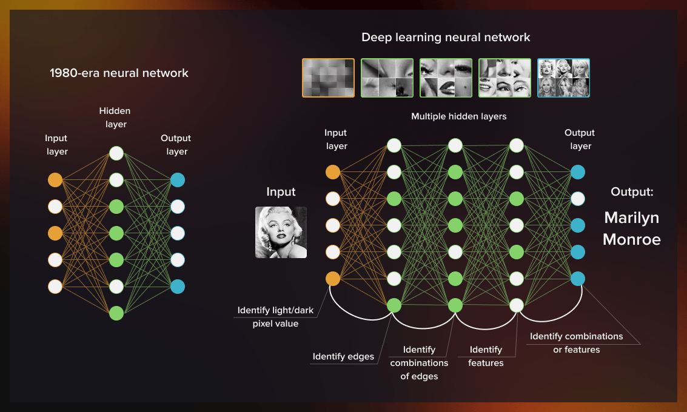

# Deep-Learning & Computer-Vision

# Introduction
- Human Perception & Computer Vision
- Math Basics

# Learning from Data
- Unsupervised
- Supervised

# Python Fundamentals

# Deep Learning
- Building Blocks
- (Convolutional) Neural Networks
